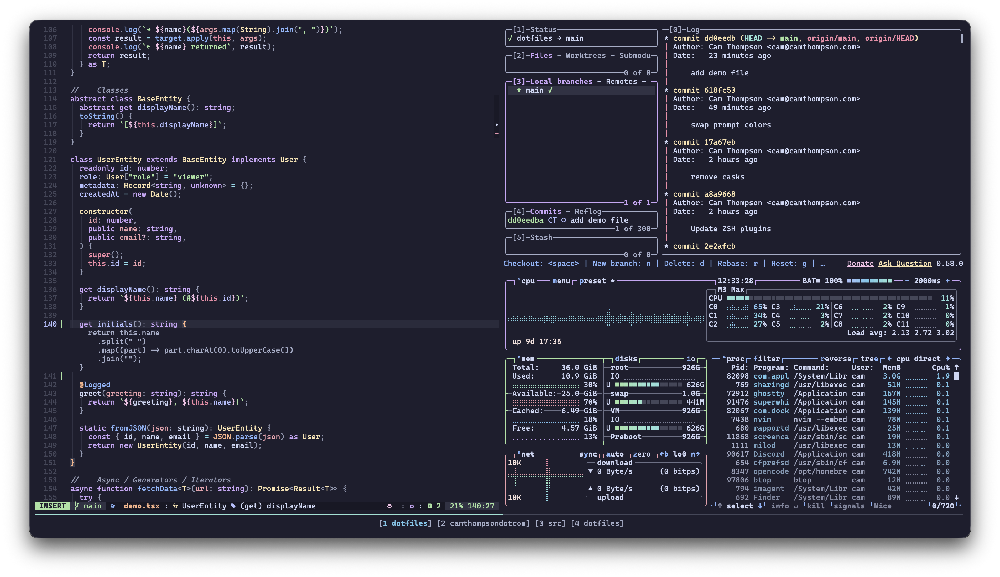

# dotfiles



My macOS terminal setup. Everything is themed with [Catppuccin Mocha](https://github.com/catppuccin/catppuccin) and managed as symlinks from this repo into `~` and `~/.config/`. Catppuccin themes are pulled in as git submodules and applied automatically by the setup script.

## What's Included

| Tool | Description |
|------|-------------|
| [Ghostty](https://ghostty.org) | GPU-accelerated terminal emulator |
| [zsh](https://www.zsh.org) | Shell with [fast-syntax-highlighting](https://github.com/zdharber/fast-syntax-highlighting), history-substring-search, and tab completions |
| [Starship](https://starship.rs) | Minimal, fast prompt with git status, Kubernetes context, and AWS profile |
| [tmux](https://github.com/tmux/tmux) | Terminal multiplexer (prefix `C-y`, integrated with vim-tmux-navigator) |
| [Neovim](https://neovim.io) | Editor via the [LazyVim](https://lazyvim.org) distribution -- Copilot, fzf-lua, neo-tree, harpoon, and ~40 plugin configs |
| [Git](https://git-scm.com) | Configured with delta for diffs, lazygit for TUI, and extensive aliases |
| [lazygit](https://github.com/jesseduffield/lazygit) | Terminal UI for git operations |
| [delta](https://github.com/dandavella/delta) | Syntax-highlighted git diffs, blame, and merge conflicts |
| [bat](https://github.com/sharkdp/bat) | `cat` replacement with syntax highlighting and git integration |
| [eza](https://github.com/eza-community/eza) | Modern `ls` replacement with git status and icons |
| [fzf](https://github.com/junegunn/fzf) | Fuzzy finder -- integrated into file, branch, PR, and process selection |
| [ripgrep](https://github.com/BurntSushi/ripgrep) | Fast code search, paired with fzf for interactive grep |
| [atuin](https://github.com/atuinsh/atuin) | SQLite-backed shell history with fuzzy search and context filtering |
| [mise](https://mise.jdx.dev) | Runtime version manager and per-directory env vars (replaces asdf + direnv) |
| [yazi](https://github.com/sxyazi/yazi) | Terminal file manager with vim keybindings and image previews |
| [glow](https://github.com/charmbracelet/glow) | Markdown renderer for the terminal (Catppuccin themed via [glamour](https://github.com/catppuccin/glamour)) |
| [chafa](https://hpjansson.org/chafa/) | Terminal image viewer (used by the `p` preview command and yazi) |
| [btop](https://github.com/aristocratos/btop) | System and process monitor |

## Key Aliases

These are defined in [`zshrc`](zshrc). A curated selection of the ones you'll use most:

| Alias | What it does |
|-------|-------------|
| `v` | Opens Neovim (`nvim`) |
| `vp` | Fuzzy-find a file with preview, open in Neovim |
| `g` | Git shorthand -- bare `g` runs `git status -s`; `g <args>` passes through to git |
| `gfo` | Fuzzy-find a git branch and check it out |
| `ghpr` | Fuzzy-find a GitHub PR, preview it, open in browser |
| `ghco` | Fuzzy-find a GitHub PR and check it out locally |
| `l` / `ll` / `la` | List files with `eza` (git status + icons; `ll` = long, `la` = all) |
| `y` | Open yazi file manager (cd to last directory on exit) |
| `z` | Fuzzy directory jump (fd + fzf) |
| `rgf` / `rgp` | Fuzzy file search / fuzzy content search with bat preview |
| `p <file>` | Preview a file -- markdown via glow, images via chafa, code via bat (opens in tmux popup when available) |
| `pfk` | Fuzzy-find a running process and kill it |
| `work` | Start the work tmux layout via tmuxinator |
| `..` / `...` / `....` | Navigate up 1, 2, or 3 directories |

### Git aliases

The most common git aliases are in [`gitconfig`](gitconfig). Highlights:

| Alias | Command |
|-------|---------|
| `g a` | `git add` |
| `g au` | `git add -u` |
| `g b` | `git branch` |
| `g c` | `git commit --verbose` |
| `g d` / `g dc` | `git diff` / `git diff --cached` |
| `g f` / `g fa` | `git fetch` / `git fetch --all` |
| `g l` / `g la` | `git log --oneline` / `--all` |
| `g o` / `g ob` | `git checkout` / `git checkout -b` |
| `g p` | `git push` |
| `g u` | `git pull` |
| `g sh` / `g sp` | `git stash` / `git stash pop` |

See [`gitconfig`](gitconfig) for the full list (~40 aliases).

## Prerequisites

1. Install [Homebrew](https://brew.sh)
2. `brew bundle` to install everything from the [Brewfile](Brewfile)
3. Set zsh as your default shell:
   ```
   sudo sh -c 'echo /usr/local/bin/zsh >> /etc/shells'
   chsh -s /usr/local/bin/zsh
   ```

## Setup

```
./setup
```

This script:
- Initializes all git submodules (ZSH plugins and Catppuccin themes)
- Symlinks tool configs (`bat`, `btop`, `ghostty`, `nvim`, `starship.toml`, etc.) into `~/.config/`
- Symlinks shell dotfiles (`zshrc`, `gitconfig`, `tmux.conf`, etc.) into `~/` with a `.` prefix
- Links Catppuccin theme files from submodules into each tool's config directory
- Sets up lazygit and k9s configs in `~/Library/Application Support/`

> **Warning:** This script `rm -rf`s existing files and directories at each target path before creating symlinks. If you have a real `~/.config/nvim` directory (or any other config), it will be **permanently deleted**, not just overwritten. Back up anything you want to keep before running this. Read through the [`setup`](setup) script to see exactly which paths are affected.

## Updating

```
./update
```

This script:
- Pulls the latest ZSH plugins and Catppuccin theme submodules
- Re-applies any changed theme configurations (lazygit, starship, bat cache)
- Runs `git pull` to fetch upstream dotfile changes

After it finishes, review the changes with `git diff` and commit anything you want to keep.

To update Neovim plugins separately, open Neovim and run `:Lazy` to open the LazyVim plugin manager.

## Customization

If you want to add your own settings without modifying tracked files, both zsh and tmux support `.local` overrides that are sourced automatically:

- **`~/.zshrc.local`** -- sourced at the end of `zshrc`. Add your own aliases, environment variables, or PATH entries here.
- **`~/.tmux.conf.local`** -- sourced at the end of `tmux.conf`. Override keybindings, status bar settings, etc.

These files are not tracked by git, so they'll survive updates and won't show up as changes in the repo.

## Gotchas

A few things that might trip you up if you're used to defaults:

- **tmux prefix is `C-y`** (not the default `C-b`). There's also a secondary prefix bound to `C-space`. See [`tmux.conf`](tmux.conf).
- **`;` and `:` are swapped in Neovim**, so you tap `;` to enter command mode. See [`nvim/lua/config/keymaps.lua`](nvim/lua/config/keymaps.lua).
- **The `g` alias disables zsh globbing** via `noglob`, so wildcards (`*`, `?`) in git commands are passed through literally instead of being expanded by the shell.

## Credits

The ZSH configuration draws heavily from [prezto](https://github.com/sorin-ionescu/prezto).
